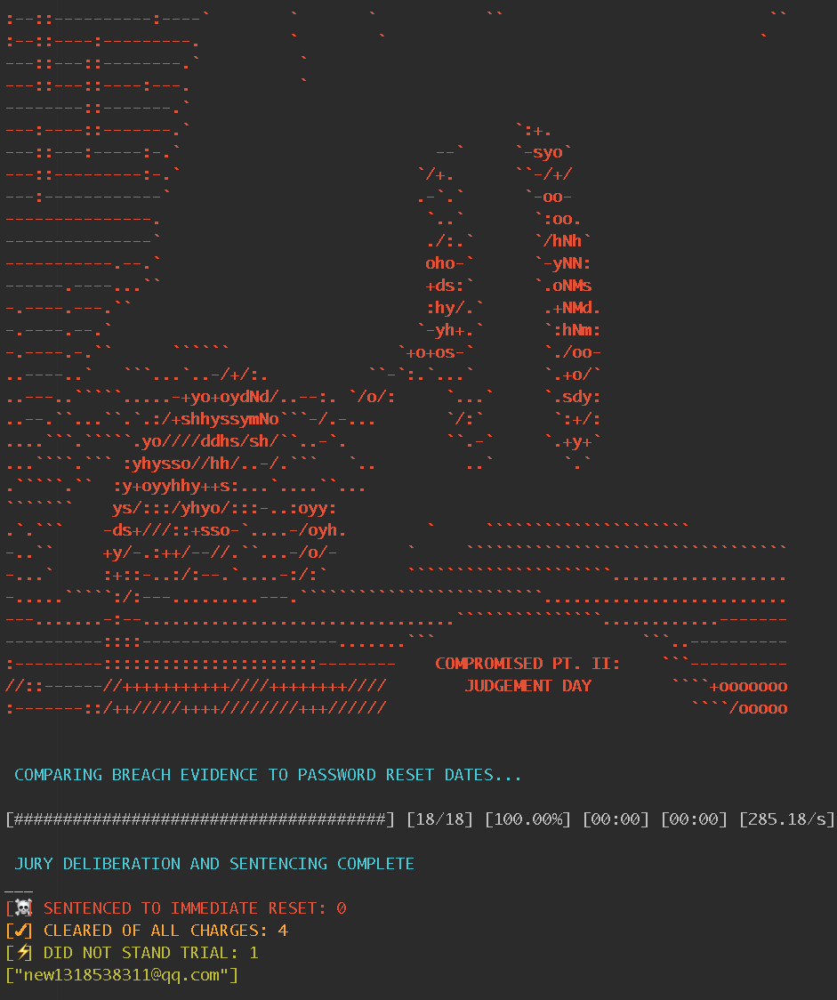

# Compromised Pt. II: Judgement Day

Companion script to Compromised Pt. I: Investigation (https://github.com/nxkennedy/compromised). Compares list of breached accounts to Active Directory dump of 'Last Password Change' dates.

<table>
    <tr>
        <th>Version</th>
        <td>1.0.0</td>
    </tr>
    <tr>
       <th>Author</th>
       <td>Nolan Kennedy
    </tr>
    <tr>
        <th>Github</th>
        <td><a href="http://github.com/nxkennedy/compromised_pt2">http://github.com/nxkennedy/compromised_pt2</a></td>
    </tr>
</table>

## Use Case

Determine if an account is highly susceptible to a password replay attack because its password hasn't changed since being involved in a breach. The assumption is that the account itself is compromised or that the user is using the same password for their comp'd account and product account. This data is obviously less useful if an org doesn't enforce a password re-use or expiration policy.

## Requirements

1. ruby >= 2.4.0
2. Install the following gems:

    `gem install paint progress_bar`

## Usage

    ruby compromised_judgment.rb <pwned-emails*.csv> <ActiveDirectory-dump.csv>

## Input
* The script assumes your input file is in the below format (produced by Amplitude Analytics tool), including headers and particularly the date format. The "LoginUserStatus" is a helpful code that determines if the account is currently active vs inactive. If input is not like below, you will have to modify the script accordingly to read your input. 

<table>
 <tr>
  <th>LoginUserStatus</th>
  <th>EmailAddress</th>
  <th>LastPwdChange</th>
 </tr>
 <tr>
  <td>1</td>
  <td>Email1@provider.com</td>
  <td>2016-07-31</td>
 </tr>
 <tr>
  <td>99</td>
  <td>Email2@provider.com</td>
  <td>NULL</td>
 </tr>
</table>

## Output
### Terminal
I wanted the terminal output formatted in a criminal court theme. Here's what the output means in plain English:
* "SENTENCED TO IMMEDIATE RESET" = Account needs password reset
* "CLEARED OF ALL CHARGES" = Account does not require a reset
* "DID NOT STAND TRIAL" = Errors raised due to misformatted input

### CSV
The "ResetRequired" column will be flagged with an "x" if a reset is required for the account. The "Status" column is just a human readable format of the "LoginUserStatus" codes above. 

<table>
 <tr>
  <th>Account</th>
  <th>Status</th>
  <th>BreachDate</th>
  <th>LastPwdChange</th>
  <th>ResetRequired</th>
 </tr>
 <tr>
  <td>Email1@provider.com</td>
  <td>Active</td>
  <td>2016-02-29</td>
  <td>2016-07-31</td>
  <td></td>
 </tr>
 <tr>
  <td>Email2@provider.com</td>
  <td>Inactive</td>
  <td>2015-03-01</td>
  <td>2014-09-14</td>
  <td>x</td>
 </tr>
 <tr>
  <td>Email3@provider.com</td>
  <td>Active</td>
  <td>2015-03-01</td>
  <td>NEVER</td>
  <td>x</td>
 </tr>
</table>
